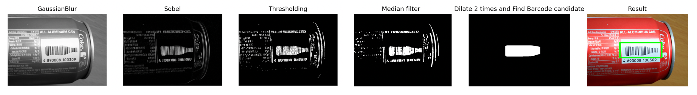
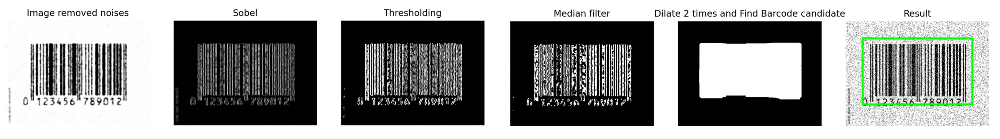
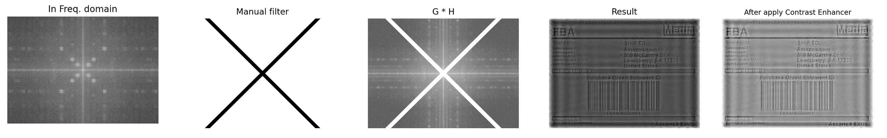
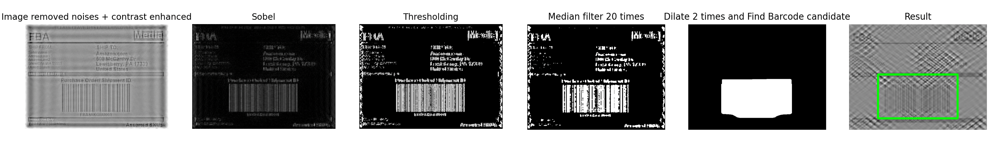

# Barcode Detector

딥러닝을 사용하지 않고, 전통적인 컴퓨터 비전 방법을 사용하여 바코드 위치를 인식하는 바코드 인식기 프로젝트입니다.  
위치 인식기는 공통 모듈 하나, 특정 이미지에서의 노이즈를 위한 각 이미지 별 노이즈 제거기를 포함합니다.

## 각 이미지별 노이즈 제거 방법

- **Barcode1.jpg**: 노이즈가 없으므로 가우시안 필터를 사용해 고주파 성분 제거 → Sobel 연산 시 노이즈 감소 효과 기대
- **Barcode2.jpg**: 솔트앤페퍼 노이즈 존재 → alpha-trimmed mean 필터 적용, 일부 데이터를 제거 후 산술평균/중앙값/기하평균 사용
- **Barcode3.jpg**: 규칙적인 노이즈 존재 → 주파수 도메인에서 대각선 방향 성분 제거로 효과적 노이즈 제거

## 공통 바코드 인식 절차
1. Sobel 연산: 수직 방향 엣지 검출
2. Otsu’s Thresholding: 엣지 강조된 부분만 이진화
3. Median 필터: 남은 자잘한 노이즈 제거 (필터 적용 횟수는 이미지별 다름)
4. Dilation: 바코드 영역 확대 및 보완
5. 바코드 위치 후보 세그멘테이션: 커널(50x100) 순회하며 밝기 비율 0.9 이상인 영역 추출
6. 바운딩 박스 좌표 추출: 후보 영역의 왼쪽 위, 오른쪽 아래 좌표로 박스 생성

## 결과
### Barcode1.jpg

### Barcode2.jpg

### Barcode3.jpg
**주파수 도메인을 활용한 노이즈 제거**

**결과**
